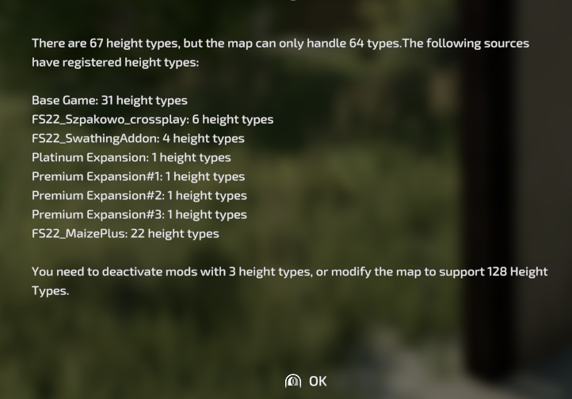

# FS22 Height Type Debugger

This script mod will provide the player with information ingame and in the log file if the current combination of mods causes too many height types for the map which is being used.

Check the "Releases" section for the most recent ZIP file.

Example output:

